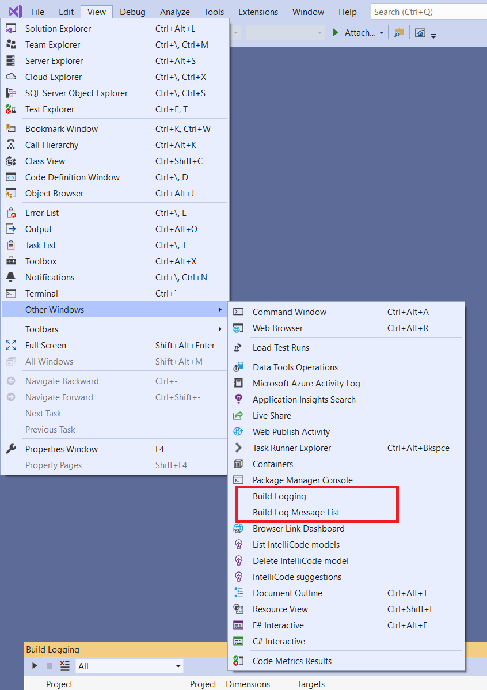
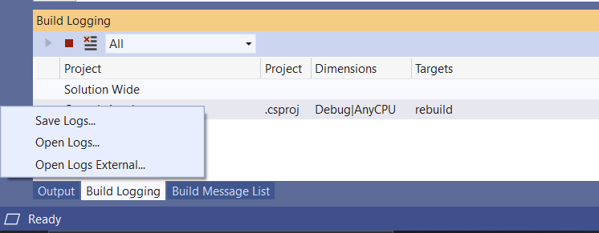
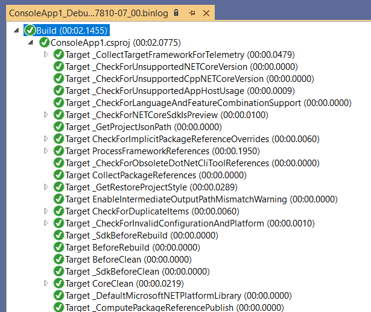
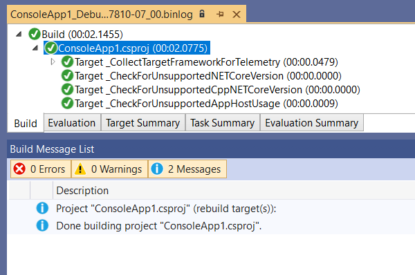

> [!IMPORTANT]
> **This extension has been discontinued.** For various reasons, the build logs it captures cannot contain as much detail as you generally need. To capture high quality build logs, follow [these instructions](#getting-higher-fidelity-logs-from-vs-vs2022-onwards) instead.

---

# Project System Tools

_Project System Tools_ is a diagnostic extension for the C#, Visual Basic, and F# Project Systems in Visual Studio.

It can be downloaded from the Visual Studio Extension Marketplace:

- [Project System Tools for Visual Studio 2022](https://marketplace.visualstudio.com/items?itemName=VisualStudioProductTeam.ProjectSystemTools2022)
  [](https://marketplace.visualstudio.com/items?itemName=VisualStudioProductTeam.ProjectSystemTools2022)
  [](https://marketplace.visualstudio.com/items?itemName=VisualStudioProductTeam.ProjectSystemTools2022)
- [Project System Tools for Visual Studio 2017 and 2019](https://marketplace.visualstudio.com/items?itemName=VisualStudioProductTeam.ProjectSystemTools)
  [](https://marketplace.visualstudio.com/items?itemName=VisualStudioProductTeam.ProjectSystemTools)
  [](https://marketplace.visualstudio.com/items?itemName=VisualStudioProductTeam.ProjectSystemTools)

## Features

Once installed, some new items appear in the `View > Other Windows` menu:



Selecting `Build Logging` will show a new pane in Visual Studio:


Click the first toolbar icon to start recording both regular and design-time builds in the project system.

Once a build is recorded, it will appear as shown. Right-clicking the build item produces a context menu:



From here you may:

- _Save Logs_ which prompts for a folder to save the `.binlog` file into
- _Open Logs_ which opens the log file inside Visual Studio
- _Open Logs External_ which opens the `.binlog` file outside of Visual Studio (we recommend https://msbuildlog.com)

The `Open Logs` option displays build results in a tree view:



By opening the `Build Message List` pane (via the `View > Other Windows` menu, as above) you can see data about the selected tree node.



## Getting higher-fidelity logs from VS (VS2022 onwards)

The build events this extension subscribes contain the most useful information for diagnosing problems, but do omit some data for performance reasons.

In cases where more information is needed in binlogs, you can configure MSBuild to automatically write diagnostic data to disk. To do this for all builds within Visual Studio:

1. Open a Developer Command Prompt for the version of Visual Studio you want to use
1. Set two environment variables:
   - Command
      ```cmd
      set MSBUILDDEBUGENGINE=1
      set MSBUILDDEBUGPATH=c:\some\path
      ```
   - PowerShell
      ```powershell
      $env:MSBUILDDEBUGENGINE = "1"
      $env:MSBUILDDEBUGPATH = "c:\some\path"
      ```
   You can use whatever path you like for `MSBUILDDEBUGPATH`, but it must be writeable by the current user.
1. Type `devenv` to start Visual Studio with this configuration
1. Open the `MSBUILDDEBUGPATH` path in Windows Explorer to see the captured binlog and other diagnostic files

For more information, see [this documentation section](https://github.com/dotnet/msbuild/blob/main/documentation/wiki/Building-Testing-and-Debugging-on-Full-Framework-MSBuild.md#logs).

If you see:

> error : The type initializer for ‘Microsoft.Build.Shared.Debugging.DebugUtils’ threw an exception.

This indicates that the path set in `MSBUILDDEBUGPATH` is not writeable by Visual Studio. Close VS, set a new path and try again.

## Contributing

We welcome contributions and suggestions!

This project has adopted a code of conduct adapted from the [Contributor Covenant](http://contributor-covenant.org/) to clarify expected behavior in our community. This code of conduct has been [adopted by many other projects](http://contributor-covenant.org/adopters/). For more information see [Contributors Code of conduct](https://github.com/dotnet/home/blob/master/guidance/be-nice.md).

## Data Collection

The software may collect information about you and your use of the software and send it to Microsoft. Microsoft may use this information to provide services and improve our products and services. You may turn off the telemetry as described in ["Visual Studio Customer Experience Improvement Program"](https://learn.microsoft.com/visualstudio/ide/visual-studio-experience-improvement-program). There are also some features in the software that may enable you and Microsoft to collect data from users of your applications. If you use these features, you must comply with applicable law, including providing appropriate notices to users of your applications together with a copy of Microsoft’s privacy statement. Our privacy statement is located at https://go.microsoft.com/fwlink/?LinkID=824704. You can learn more about data collection and use in the help documentation and our privacy statement. Your use of the software operates as your consent to these practices.

## Trademarks

This project may contain trademarks or logos for projects, products, or services. Authorized use of Microsoft trademarks or logos is subject to and must follow [Microsoft's Trademark & Brand Guidelines](https://www.microsoft.com/legal/intellectualproperty/trademarks/usage/general). Use of Microsoft trademarks or logos in modified versions of this project must not cause confusion or imply Microsoft sponsorship. Any use of third-party trademarks or logos are subject to those third-party's policies.
